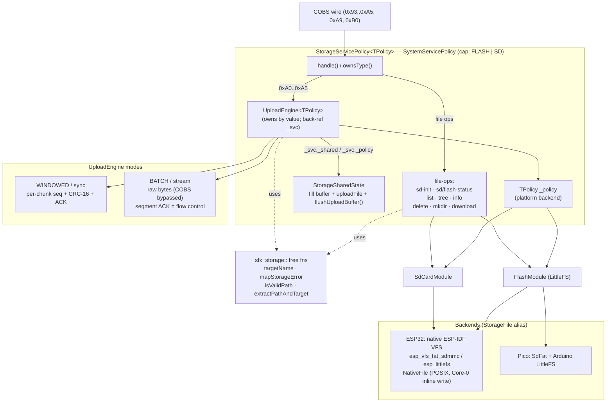
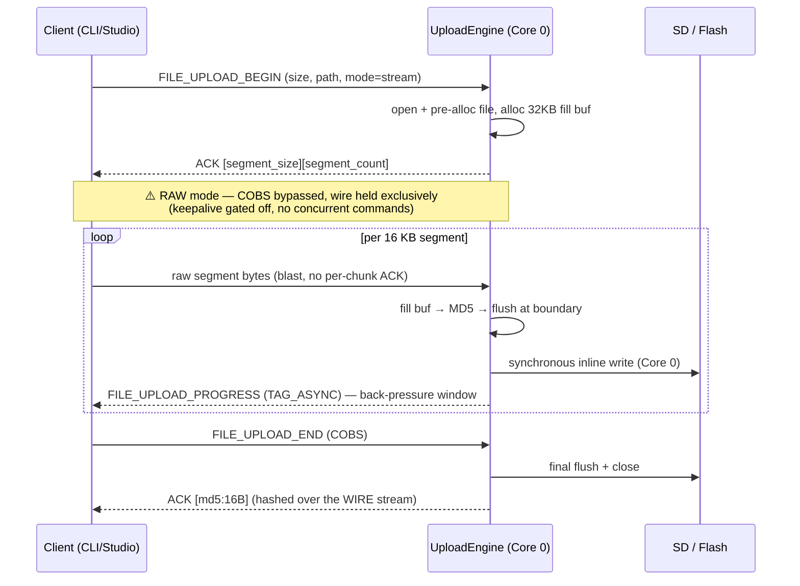
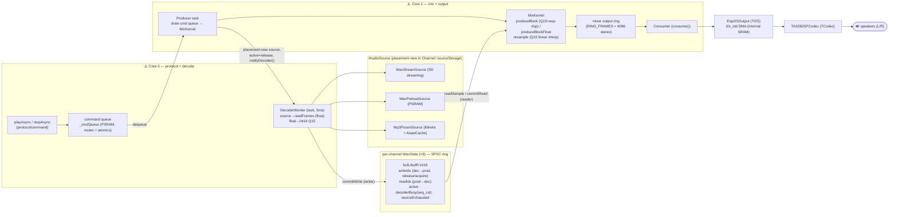
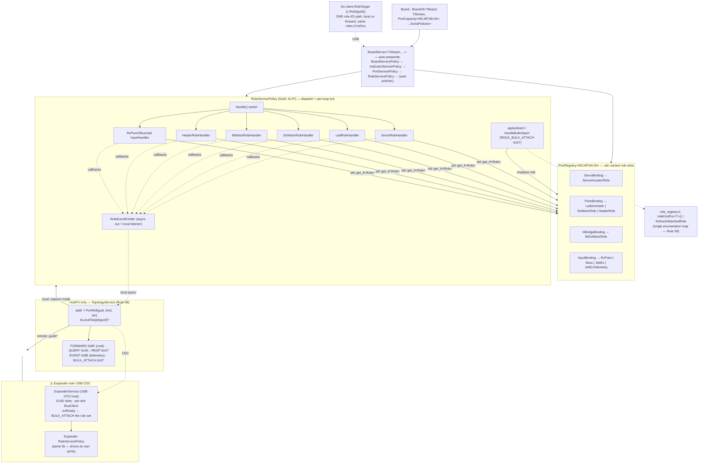
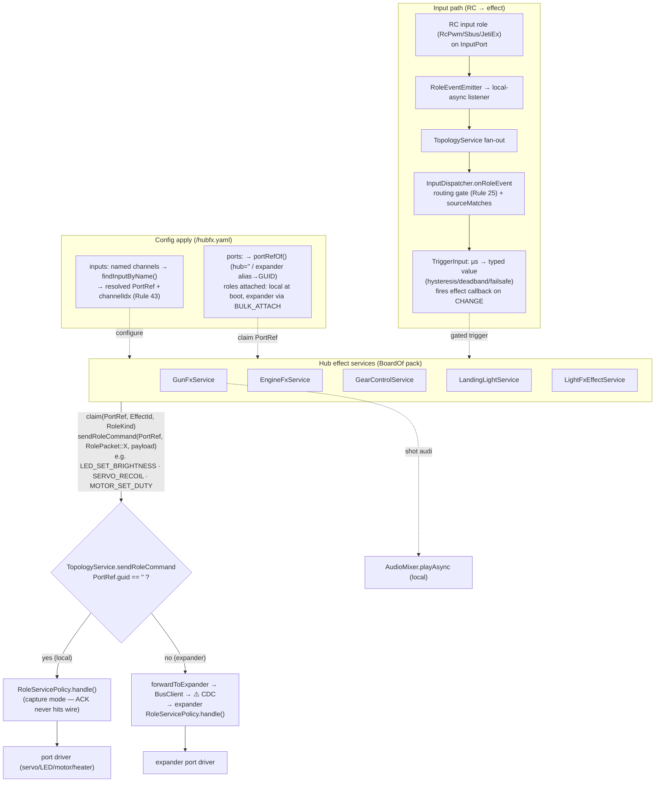

# 32 — Architecture Diagrams

> **Status:** active reference &middot; **Read when:** you need a visual map of storage / audio / ports-roles-topology / effects data flow. &middot; **TL;DR:** Mermaid diagrams of the four core subsystems reflecting the post-decomposition `BoardServer<...>` codebase and Rule 58 transparent expander roles.

Visual reference for the four core subsystems. Diagrams are Mermaid (GitHub /
VS Code render them inline). They reflect the post-decomposition codebase
(2026-06-09): `BoardServer<...UserPolicies>` framework, the decomposed
storage / audio / role layers, and Rule 58 transparent expander roles.

Cross-cutting conventions used below:
- **⚠️ boundary** = a core boundary (dual-core) or a hub↔expander (USB-CDC) boundary.
- A `*ServicePolicy` is a `SystemServicePolicy` composed into a board's
  `BoardServer<...>` pack (`kCapabilityBits / begin / ownsType / handle / update`).

---

## 1. Storage

`StorageServicePolicy<TPolicy>` is the filesystem-query + dispatch core;
`UploadEngine<TPolicy>` is the exclusive upload state machine pulled out of it
(reaches the shared buffer + platform policy via a back-reference). Stateless
helpers live in `storage_path_util.h`. The platform `TPolicy`
(`Esp32StoragePolicy` / `PicoStoragePolicy`) is chosen at compile time.

Files: [storage_service.h/.ipp](../controllers/lib/sfx_storage/server/storage_service.h),
[storage_upload_engine.h/.ipp](../controllers/lib/sfx_storage/server/storage_upload_engine.h),
[storage_path_util.h](../controllers/lib/sfx_storage/server/storage_path_util.h),
[esp32/](../controllers/lib/sfx_storage/server/esp32/) · [pico/](../controllers/lib/sfx_storage/server/pico/).

**Batch (stream) upload — the wire-critical path (Rules 53/54/56/57):**

Exclusivity: `onUploadStart`/`onUploadEnd` suspend audio + other subsystems for
the duration; `wireUploadExclusivity<Mixer>(storage)` wires the audio side.

---

## 2. Audio + audio pipeline

`AudioMixer<TI2S,TCodec>` decomposed into one class per responsibility:
`WavState` (per-channel SPSC decode ring + seq_cst teardown), `MixKernel`
(Q15/float mix), `DecoderWorker` (Core-0 decode task), `SoundQueue` (per-channel
FIFO). The pipeline is dual-core: **Core 0 decodes, Core 1 mixes + plays.**

Files: [audio_mixer.h](../controllers/lib/sfx_audio/audio/audio_mixer.h) (+ `audio_mixer_{wavstate,mixkernel,decoder}.ipp`),
[audio_source.h](../controllers/lib/sfx_audio/audio/audio_source.h),
[esp_dual_core_audio.h](../controllers/lib/sfx_audio/audio/esp_dual_core_audio.h).

Teardown safety (Rule 15): a rapid stop/start frees the source on the
producer/command side while the decoder may be mid-refill — guarded by the
`decoderBusy` **seq_cst** handshake (`destroySafe()` clears `active`, waits
`decoderBusy` false, then runs the dtor). Skipping it = `LoadProhibited@0`.

---

## 3. Ports, roles & topology

A board declares its ports; `BoardOf<>` sizes a `PortRegistry` and composes the
policy pack. `RoleServicePolicy` attaches a role into each port's
`std::variant` slot and dispatches drive/query packets to per-family handlers.
On the hub, `TopologyService` makes an expander's roles behave hub-locally
(Rule 58) via opaque, `PortRef`-addressed transport over USB-CDC.

Files: [board_of.h](../controllers/lib/sfx_board/server/board_of.h) · [board_server.h](../controllers/lib/sfx_board/server/board_server.h) · [port_registry.h](../controllers/lib/sfx_board/server/port_registry.h) · [port_bindings.h](../controllers/lib/sfx_board/server/port_bindings.h) · [role_service.h/.cpp](../controllers/lib/sfx_board/server/role_service.h) · `role_*_handler.*` · [role_event_emitter.h](../controllers/lib/sfx_board/server/role_event_emitter.h) · [role_registry.h](../controllers/lib/sfx_board/server/role_registry.h) · [topology_service](../controllers/hubfx/esp32s3/src/topology/) · [expander_service](../controllers/hubfx/esp32s3/src/expanders/).

Every role exposes itself by adding its **codec + one line in `roleKindFor<>()` +
a `RoleTarget` wrapper** — never a per-role `switch` in the transport, forward,
query, event, or Go dispatch.

---

## 4. Effects → ports flow

Hub effect services never call `RoleServicePolicy` directly and never branch on
hub-vs-expander. Each builds a role-command payload and calls
`_topo->sendRoleCommand(PortRef, innerType, payload)` — the single transparent
router. Inputs flow back the other way: an RC input role's frame → emitter →
topology fan-out → `InputDispatcher` → `TriggerInput` gate → the effect.

Files: [effects/](../controllers/hubfx/esp32s3/src/effects/) (`gunfx`, `enginefx`, `gearcontrol`, `lightfx`, `landing_lights`, `input/`) · [role_command.h](../controllers/hubfx/esp32s3/src/effects/role_command.h) · [apply_hubfx_config.h](../controllers/hubfx/esp32s3/src/config/apply_hubfx_config.h).

**Single-router invariant:** effects (C++) and Studio/CLI (Go `RoleTarget`) each
have exactly one role-I/O path. The same effect code drives a hub-local servo
and an expander-hosted servo — only `PortRef.guid` differs.

---

## Maintaining these diagrams

These are **docs-as-code** (Rule 0). When a decomposition or data-flow changes,
update the matching diagram in the same commit. Each subsystem's deep doc links
here: storage → [27-WIRE-ASYNC-AND-UPLOAD.md](27-WIRE-ASYNC-AND-UPLOAD.md) ·
audio → [sfx_audio/README](../controllers/lib/sfx_audio/README.md) ·
ports/roles/topology → [16-EXPANDER-BOARD-DESIGN.md](16-EXPANDER-BOARD-DESIGN.md) + [sfx_board/README](../controllers/lib/sfx_board/README.md) ·
effects → [21-STUDIO-ENGINEFX-PANEL.md](21-STUDIO-ENGINEFX-PANEL.md).
